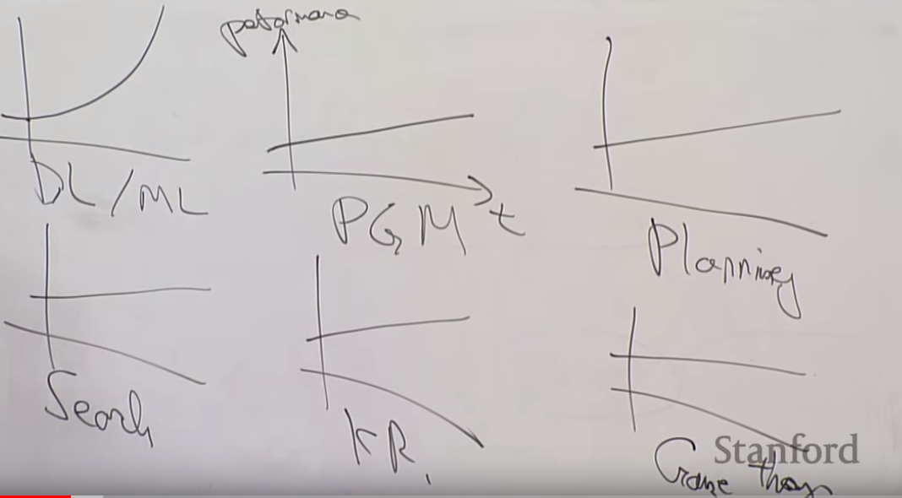

<https://www.youtube.com/watch?v=PySo_6S4ZAg&list=PLoROMvodv4rOABXSygHTsbvUz4G_YQhOb>

deep learning taking off now

- data more available
  - xray records more likely to be digital
  - buying data
  - from paper to digital
- before, NNs like Support Vector machines, etc, plataued with data added, but now: small NN => plataues later. Large NN => plataues even later
- large NN able to be trained now due to GPU training

- DL/ML, PGM, Planning Algorithm, Search Algorith, Knowledge Graph, Game Theory

  - 

- Uncertainty in AI conference

- overall software architecture vs just understanting the syntax: difference between senior software developer and junior one

  - not just know how to implement something in Keras or TF or whatever, a bit more too

- somtimes not more time-efficient to just get loads of loads of data

  - better things you might do: hypertuning parameters, etc

- mlyearning <- book by this guy

  - <https://github.com/yennlh/ml-yearning/blob/master/Ng_MLY01_13.pdf>

- <https://www.deeplearning.ai/>

- ML like the new electricity

  - electricity transformed pretty much every industry

- internet era

  - shopping mall + website != internet company
    - (unlike amazon, etc)

  - A/B testing
  - short shipping times
  - decision making by engineers

- AI era

  - company + NN != ai company
  - strategic data aquisition
  - unified data warehouses
  - spotting automation opporuinities
  - new jobs descriptions (e.g: internet: backend, frontend, devops, etc)

- scrum, agile development, code review, etc <-- still in the process of developing these for AI teams

- project ideas
  - sign language (numbers) detection
  - detect if face happy or sad
  - object detection (YOLOv2)
  - optimal goalkeeper shoot prediction
  - car detection
  - face recognition
  - art generation (neural style transfer)
  - music generation
  - text generation
  - emojifier
  - machine translation (human date to machine date)
  - trigger word detection (e.g: ok google!)
  - colouring black/white images
  - image -> price of item
  - predicting atom energy based on atomic-structure
  - music classigication/ music compression