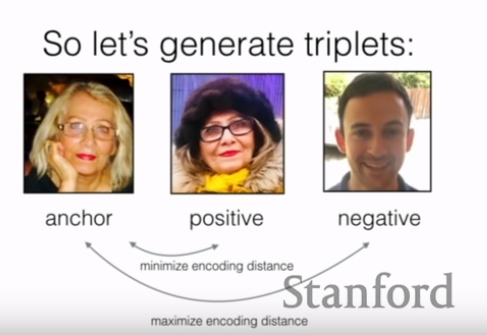
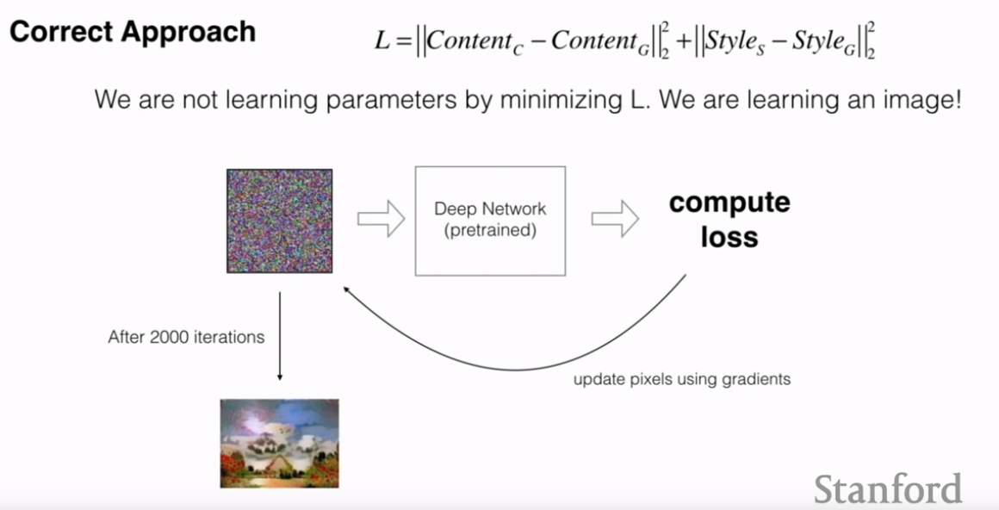
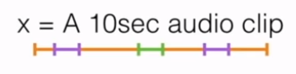
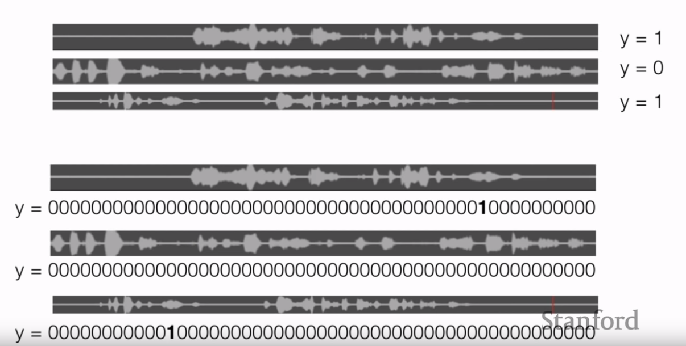
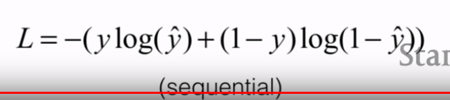
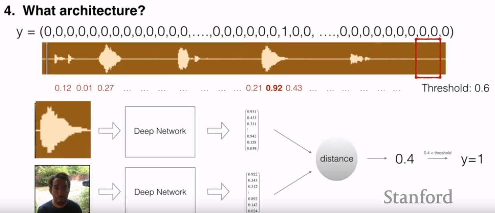
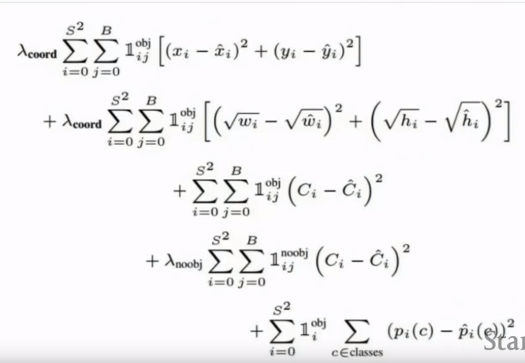
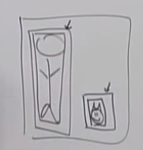

<https://www.youtube.com/watch?v=AwQHqWyHRpU&list=PLoROMvodv4rOABXSygHTsbvUz4G_YQhOb&index=2>

- good way to think of model: architecture + parameters
  - loss function
  - activation function
  - optimiser (ADAM, etc)
  - hyperparameters (learning rate, etc)
- way of labelling output data
  - one-hot encoding
    - if you have LOT of classes, could have long vectors, but not too bad
  - multi-hot encoding
    - can detect if CAT and HORSE in img:
      - would need different activation though: not sigmoid: softmax
    - $$a^{[1]}_3$$ = 3d parameter in 1st layer

# day and night classification

- how to know how much data you need
  - gauge complexity of the class: compare to projects before - how much they needed + is this project simpler or easier
- how to split data into training/testing. Usually like 80-20, but the more images you have, the more you would tend to put in the training data
- resolution of images? as low as you can while still achieving good performance
  - compare to human performance - minimum resolution for human to be able to tell
- sigmoid used as activaion: -inf to inf squished to give like a probability
- logistic loss function:
  - logistic loss function proven to be esasier to optimise for a classification problem
  - L1 loss harder -> would use this for regression problems

# face verification

- is colour important?
  - invariant to if you got a tan, etc
  - differentiate between different colour people
  - invariant to lighting conditions
- error analysis
  - see which type of images the NN not good on, and put more of that kind of images in the dataset (make dataset better iteratively)
- architecture? encoding vector -> distance on these vectors
- how to make encoder? need more data -> can use online datasets
- issue with classifier - one hot vector technique
  - will need to modify network each time student body changes
    - need to retrain everything all the time
- two pictures of same person, want similar encoding
- two pictures of different people, different encoding
- use triplets:
  - 
- what should be loss function should we minimise?
  -  L = (L2 distance between Enc(A) and Enc(P)) - (L2 distance between Enc(A) and Enc(N))  $$+\alpha$$
  - how to not have negative loss: $$\max(0, L)$$
  - why need $$a$$
    - called the margin
    - pushing the network to learn something meaningful
    - avoid Network to stabilise on 0

# Face Recognition

- no ID anymore - camera just looks at you and finds you
- maybe add a face detection system to the pipeline (crop the face, then send this output to another net) -> but can be used in Face Verification (previous example) too
- use the same network as before, but rather than 1-1 comparison, 1-n comparison
  - O complexity: n
  - K-Nearest Neighbours
- face clustering
  - K-Means Algorithm
  - how do you define the K?
    - try different values - look at a certain loss?
    - X-Means
      - find the K
    - elbow method

# art generation

- content image + style image -> generated image
- only want to extract non-localised info from syle image:
  - e,g: there is a tree on the left of style image, but no tree on left in output image
- take a model that understands images very well
- get output from first few layers after passing content image through the net: $$Content_c$$. Same for style image: $$Style_c$$
- which loss should we minimise?
  - L = (L2 difference between $$Style_S - Style_G$$) + (L2 difference between $$Content_S - Content_G$$)
  - where _G means the generated image
- we are not training a network. Use the ImageNet Net - pretrained.
  - compute Loss (said above)
  - update the pixels of initially randomly generate image and update using gradients
  - 
- why do you start with white noise instead of the content image or the style image?
  - might converge quicker?
  - if give content to start with: will have bias towards the content

# trigger word detection

- given 10s audio speech, detect the word "activate"
- need a lot of data because a lot data because different accens
- distribution? : as many accents as you can: female, male, age, etc
- input: labelled data with positive word (green) and negative words (purple): 
- output: 0 or 1
- more precise labelling scheme that indicates time:
  - 
  - in top one: even human would struggle what the activate word actually is
  - NB: first one would work too though, but would need a lot of data
- NB: this labelling scheme also very biased toward 0 (LOT of 0s wrt 1s). Therefore NN biased to produce 0s. Hack: add a bunch of 1s after the word lol
- last activation: sigmoid (sequential)
- Architecture should be like RNN
- Loss: logistic loss function
  - 
- what is critical to the success of this project?
  - strategic data collection/labelling process
    - pay people
    - go around with phone, record random ppl kek (with good distribution)
    - label by hand?
      - super slow
    - subtitles in movies
    - collect 3 databases
      - positive word database
      - negative word database
      - background database
      - then synthesise samples, by putting these together (such that they don't overlap)
        - = automatic data generation
  - architecure and hyperparameter tuning?
    - spectogram
    - LSTM with sigmoid layer + threshold them
    - but this has several issues (got from expert):
      - fourier transform hyperparameters? window size, etc
      - RNN too big?
        - use conv + BN to
      - use batchnorm
      - expansion algorithm: 0 -> 2 0s. 1 -> 2 1s.

# TWD (Trigger Word Detection) other approach

- use tripplet loss algorithm:
  - anchor: word "activate"
  - positive: word "activate" said differently
  - negative word: different word
- compare distance between vectors
- 

# YOLO

- lol YOLO loss function
- 
  - first term: coords minimize (center of bounding box)
  - second term: widths heights of bounding box
  - objectness
  - no object: lower probability of objectness
  - final term: class
- why we have sqroot here?
  - because wanna penalise width/height errors more on small bounding boxes than on larger boxes
  - 
    - cat error penalised more because box smaller