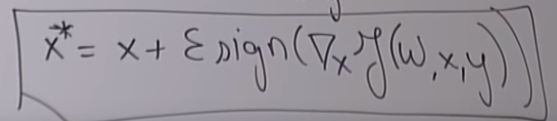

https://www.youtube.com/watch?v=ANszao6YQuM&list=PLoROMvodv4rOABXSygHTsbvUz4G_YQhOb&index=4>

# Adversarial Examples

- even state of the art NNs vulnerable to this
- goal: given a network pretrained on ImageNet, fnid an image that is not an iguana but will be classified as an iguana

- want to minimize loss function such that output is iguana. Backprop the loss function all the way back to the input

why will it not look like an iguana?

- in terms of probability, high chance it won''t look like iguana
- Network is deterministic => any input image will result in an output.
  - The space of possible input images VERY big compared to its subset: space of real images
  - 
  - more likely to be in green section

okay this case not too harmful, but what if maliciously to get a NN to missclass a picture, can be malicious

- e.g: stop sign that looks like stop sign to everyone, but not to self driving car

to do the above:

new loss func: 

- what should be initial we start with?
  - start with the cat - faster

star is where adversarial examples are:

### defenses against adversarial examples

types of attacks: non-targetted, tageted attacks

- non-targetted: just fool the NN
- try get the NN to misclassify

knowledge: white box (full access to gradients, etc), black box (not). Even for black box model: can do numerical gradient

- nb: assuming can even (multiple times) query the NN
- what if can't query too?
  - Adversarial examples are quite transferrable: can build my own classifier, then create adversarial examples with this: then give to NN
    - examples likely so transferrable because classifiers tend to be learning similar types of features

defenses:

- safety net: NN that decides if input image is fake or not
  - can just make adversarial example for this safetyNet NN too: but makes it more complex because the image would need to fool both networks
- generate adversarial examples, and label them properly and feed them into the network.
  - generating adversarial examples is quite costly: also, NN may not generalise to other examples: may just overfit to given adversarial examples
- adversarial training
  - 
  - expensive: need to generate adversarial example for each step in training
  - 
    - todo

Why are NNs vulnerable to adversarial examples?

- some people argue adversarial examples are a result of overfitting: makes sense tbh (not fully generalising NNs - NN doesn't _fully_ know what a cat is)
- linear regression
  - L1 or L2 loss because regression problem
  - 
  - insights for this example:
    - the larger w is,  => x^* less likely to be close to x
      - sign(w)
    - as x grows in dimension, impact of +$$\epsilon \text{sign}(w)$$increases
      - b/c more terms here:
      - 
      - dimensions very high for images: so impact of epsilon sign(w) increases
- fast gradient sign method:
  - 
  - linear
  - notice: we are trying to lineraise NNs currently (RELU, etc) - because fast training?
    - so likely good for deeper NNs
  - networks that have high gradients, even more vulnerable to adversarial examples...

do networks actually understand data?

- GANs :thinking:

# GANs

- hard to train

- Motivation: get computers to understand our world
- Goal: train & generate similar data from scratch
- Intuition: num parameters << num data

Not really supervised learning

Want Network to output things that we've never seen: generate cat but not overfit and generate the same cat that we inputted

G/D Game:

- Discriminator: detect if an image is real or not (binary classifier)
  - give it some images which are real, some which are generated

Training:

Want to minimise:

- the cost of the discriminator
  - 
  - want it to identify real data, and also identify fake data
- cost of generator:
  - want G to fool D
  - we want D to classify generated images as "1"

It's a game:

- if D is bad, and G fools D, that doesn't necessarily mean that G is good (because D just may be good)
- want both to get good

Consider loss function for generator:

G(z) is the output of the generator, given an input z. D(G(z)) is the discriminator's output, given the output of the generator.

Notice: near the start of training, DG(z) is typically going to be around 0, and near the end it's gonna be around 1. We want loss function to have a steep gradient when around 0 and shallow gradient (smaller steps) as DG(z) around 1. So log(DG(z)) is prob best loss function on the board.

Mathematical trick 'min/max':

use this to convert our function from a 'saturating cost' to a 'non-saturating cost'

So, new training procedure:

# Are GANs created equal?

- a study of all the loss functions and stuff that people have tried

# Simultaneously Training G/D?

- D is usually easier to train than G
- but as D improves, G can improve
  - and if D doesn't improve, G can't improve
- so the performance of G has an upper bound to what D can achieve
- so: will usually train D more iterations per epoch

# Results

Operations on codes:

Woah: image of man with glasses - man + woman = woman with glasses

linear operations on the latent space of the codes have a direct and intuitive result on the output

- using a GAN, generate satellite image from map image
  - NB: can have an actual image as input!

Try:

Goal: convert horses to zebras in images, and vice-versa

- Data: horses and zebras
  - Pair images needed?
    - Horse/Zebra dopplegangers
  - Nah: do unpaired images: no mapping between them
- Architecture: Cycle-GAN

- that second generator there is to enforce that the G1(H) output is similar to the input image. I.e: G2(G1(H)) should try to be = H

Cycle-GAN:

Loss to minimise?

- 
- Want an additional term $J^{cycle}$, which gives the distance between G2(G1(H)) and H  and G1(G2(Z)) and Z. The others are standard GAN losses (for discriminator and etc)

LOL Face2Ramen then back to Ramen again:

LOL and detect faces and replace them with Ramen

Another application

- Conditioned GAN (Image-Image GAN)
- from edges to an actual image
- 

Also: super-resolution

- easy to make data too: just get images, downscale them

Other

- **Generate a dataset from medical dataset, which is similar to the original dataset, but anonymised and etc (bc privacy important in medical applications)** - clinical data sharing
- Use GANs to generate personalised objects to replace bones in humans

# How to evaluate GANs?

- Can't just say: look at them and see if they look 'real'
  - because may be overfitting
- human annotators: which they feel like is generated or not
  - 
  - Experiments: flash image for quick time and ask if real for e.g
  - not scalable (humans :( )
- 'Inception score' - a NN
  - 
- alt:
  - 

